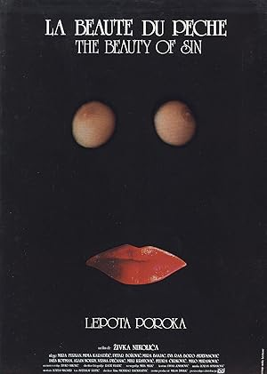

# Filmovi

## Murican
### Don't Worry Darling (2022)

**IMDB**: 6.3 [link](https://www.imdb.com/title/tt10731256/)

**Opis**: While her husband leaves home everyday to work in a top secret facility, a young 1950s housewife begins to question her life when she notices strange behavior from the other wives in the neighborhood.

**Glumci**: Florence Pugh, Harry Styles, Chris Pine

### Winnetou (1963)

**IMDB**: 6.8 [link](https://www.imdb.com/title/tt0057687/)

**Opis**: When violent conflict breaks out between greedy railroaders and a tribe of Mescalero Apaches, only two men, destined to be blood brothers, can prevent all-out war: chief's son Winnetou and German engineer Old Shatterhand.

**Glumci**: Lex Barker, Pierre Brice, Marie Versini

### The Spanish Prisoner (1997)

**IMDB**: 7.2 [link](https://www.imdb.com/title/tt0120176/)

**Opis**: An employee who develops a lucrative secret process for his corporation is tempted to betray the company when higher ups attempt to take the process from him. Dastardly intrigue ensues.

**Glumci**: Steve Martin, Ben Gazzara, Campbell Scott

### Butch Cassidy and the Sundance Kid (1969)

**IMDB**: 8.0 [link](https://www.imdb.com/title/tt0064115/)

**Opis**: In 1890s Wyoming, Butch Cassidy and The Sundance Kid lead a band of outlaws. When a train robbery goes wrong, they find themselves on the run with a posse hard on their heels..

**Glumci**: Paul Newman, Robert Redford, Katharine Ross

### The Hot Spot (1990)

**IMDB**: 6.4 [link](https://www.imdb.com/title/tt0099797/)

**Opis**: Upon arriving to a small town, a drifter quickly gets into trouble with the local authorities - and the local women - after he robs a bank.

**Glumci**: Don Johnson, Virginia Madsen, Jennifer Connelly

### Coyote Ugly (2000)

**IMDB**: 5.8 [link](https://www.imdb.com/title/tt0200550/)

**Opis**: Aspiring songwriter Violet Sanford, after getting a job at a women-run NYC bar that teases its male patrons, comes out of her shell.

**Glumci**: Piper Perabo, Adam Garcia, John Goodman

### Everything You Always Wanted to Know About Sex * But Were Afraid to Ask (1972)

**IMDB**: 6.7 [link](https://www.imdb.com/title/tt0068555/)

**Opis**: Seven stories are trying to answer the question: what is sex? Or maybe they are not trying.

**Glumci**: Woody Allen, Gene Wilder, Louise Lasser

### Vicky Cristina Barcelona (2008)

**IMDB**: 7.1 [link](https://www.imdb.com/title/tt0497465/)

**Opis**: Two friends on a summer holiday in Spain become enamored with the same painter, unaware that his ex-wife, with whom he has a tempestuous relationship, is about to re-enter the picture.

**Glumci**: Rebecca Hall, Scarlett Johansson, Javier Bardem

### Gone with the Wind (1939)

**IMDB**: 8.2 [link](https://www.imdb.com/title/tt0031381/)

**Opis**: A sheltered and manipulative Southern belle and a roguish profiteer face off in a turbulent romance as the society around them crumbles with the end of slavery and is rebuilt during the Civil War and Reconstruction periods.

**Glumci**: Clark Gable, Vivien Leigh, Thomas Mitchell

### Thoroughly Modern Millie (1967)

**IMDB**: 6.9 [link](https://www.imdb.com/title/tt0062362/)

**Opis**: In New York City during the Roaring Twenties, would-be flapper Millie Dillmount's self-appointed mission to marry her boss is complicated by white slavers and true love.

**Glumci**: Julie Andrews, James Fox, Mary Tyler Moore

### Blue Ruin (2013)

**IMDB**: 7.1 [link](https://www.imdb.com/title/tt2359024/)

**Opis**: A mysterious outsider's quiet life is turned upside down when he returns to his childhood home to carry out an act of vengeance. Proving himself an amateur assassin, he winds up in a brutal fight to protect his estranged family.

**Glumci**: Macon Blair, Devin Ratray, Amy Hargreaves

### He's Just Not That Into You (2009)

**IMDB**: 6.4 [link](https://www.imdb.com/title/tt1001508/)

**Opis**: This Baltimore-set movie of interconnecting story arcs deals with the challenges of reading or misreading human behavior.

**Glumci**: Ginnifer Goodwin, Jennifer Aniston, Jennifer Connelly

### Woodstock (1970)

**IMDB**: 8.1 [link](https://www.imdb.com/title/tt0066580/)

**Opis**: Oscar-winning musical chronicle that brilliantly captures the three-day rock concert and celebration of peace and love that became a capstone for the Sixties.

**Glumci**: Joan Baez, Richie Havens, Roger Daltrey

### The Talented Mr. Ripley (1999)

**IMDB**: 7.4 [link](https://www.imdb.com/title/tt0134119/)

**Opis**: In late 1950s New York, a young underachiever named Tom Ripley is sent to Italy to retrieve Dickie Greenleaf, a rich and spoiled millionaire playboy. But when the errand fails, Ripley takes extreme measures.

**Glumci**: Matt Damon, Gwyneth Paltrow, Jude Law

### City Lights (1931)

**IMDB**: 8.5 [link](https://www.imdb.com/title/tt0021749/)

**Opis**: With the aid of a wealthy erratic tippler, a dewy-eyed tramp who has fallen in love with a sightless flower girl accumulates money to be able to help her medically.

**Glumci**: Charles Chaplin, Virginia Cherrill, Florence Lee

### The Menu (2022)

**IMDB**: 7.2 [link](https://www.imdb.com/title/tt9764362/)

**Opis**: A young couple travels to a remote island to eat at an exclusive restaurant where the chef has prepared a lavish menu, with some shocking surprises.

**Glumci**: Ralph Fiennes, Anya Taylor-Joy, Nicholas Hoult

### Can't Hardly Wait (1998)

**IMDB**: 6.5 [link](https://www.imdb.com/title/tt0127723/)

**Opis**: A complete graduating class, consisting of beautiful girls, geeks and promising footballers, assemble at a rich classmate's residence for a party. Interesting developments follow at the get-together.

**Glumci**: Jennifer Love Hewitt, Ethan Embry, Charlie Korsmo

### The Endless Summer 2 (1994)

**IMDB**: 7.6 [link](https://www.imdb.com/title/tt0109729/)

**Opis**: Two famous surfers, Patrick O' Connell and Robert "Wingnut" Weaver, set out for an international worldwide surfing safari adventure with documentary filmmaker Bruce Brown.

**Glumci**: Patrick O'Connell, Robert 'Wingnut' Weaver, Robert August

### Cocktail (1988)

**IMDB**: 5.9 [link](https://www.imdb.com/title/tt0094889/)

**Opis**: A talented New York City bartender takes a job at a bar in Jamaica and falls in love.

**Glumci**: Tom Cruise, Bryan Brown, Elisabeth Shue

### Scarface (1932)

**IMDB**: 7.7 [link](https://www.imdb.com/title/tt0023427/)

**Opis**: An ambitious and nearly insane violent gangster climbs the ladder of success in the mob, but his weaknesses prove to be his downfall.

**Glumci**: Paul Muni, Ann Dvorak, Karen Morley

**Note**: Pre-Code Hollywood

### Boat Trip (2002)

**IMDB**: 4.9 [link](https://www.imdb.com/title/tt0285462/)

**Opis**: Two straight men mistakenly end up on a "gays only" cruise.

**Glumci**: Cuba Gooding Jr., Horatio Sanz, Roselyn Sanchez

### Who's Afraid of Virginia Woolf? (1966)

**IMDB**: 8.0 [link](https://www.imdb.com/title/tt0061184/)

**Opis**: A middle-aged New England associate professor and his wife, with the help of alcohol, use their young guests to fuel anguish and emotional pain towards each other over the course of a distressing night.

**Glumci**: Elizabeth Taylor, Richard Burton, George Segal

### Drinking Buddies (2013)

**IMDB**: 6.1 [link](https://www.imdb.com/title/tt2265398/)

**Opis**: Luke and Kate are coworkers at a brewery who spend their nights drinking and flirting heavily. One weekend away together with their significant others proves who really belongs together and who doesn't.

**Glumci**: Olivia Wilde, Jake Johnson, Anna Kendrick, Ron Livingston

### The Words (2012) (Plagijator)

**IMDB**: 7.0 [link](https://www.imdb.com/title/tt1840417/)

**Opis**: A writer at the peak of his literary success discovers the steep price he must pay for stealing another man's work.

**Glumci**: Bradley Cooper, Dennis Quaid, Olivia Wilde

### Vanilla Sky (2001)

**IMDB**: 6.9 [link](https://www.imdb.com/title/tt0259711/)

**Opis**: A self-indulgent and vain publishing magnate finds his privileged life upended after a vehicular accident with a resentful lover.

**Glumci**: Tom Cruise, Penélope Cruz, Cameron Diaz

### The Sunset Limited (2011)

**IMDB**: 7.3 [link](https://www.imdb.com/title/tt1510938/)

**Opis**: Through a chance encounter, two men of opposing ideologies deliberate spiritual, philosophical, and profound matters in a New York City apartment.

**Glumci**: Samuel L. Jackson, Tommy Lee Jones

### Diner (1982)

**IMDB**: 7.0 [link](https://www.imdb.com/title/tt0083833/)

**Opis**: A group of college-age buddies struggle with their imminent passage into adulthood in 1959 Baltimore.

**Glumci**: Steve Guttenberg, Mickey Rourke, Kevin Bacon

### Dark City (1998)

**IMDB**: 7.6 [link](https://www.imdb.com/title/tt0118929/)

**Opis**: A man struggles with memories of his past, which include a wife he cannot remember and a nightmarish world no one else ever seems to wake up from.

**Glumci**: Rufus Sewell, Kiefer Sutherland, Jennifer Connelly

## Domaći

### Pocetni udarac (1990)

**IMDB**: 7.1 [link](https://www.imdb.com/title/tt0188149/)

**Opis**: A group of students with varying family backgrounds begin to question their lives and the hypocritical values of their corrupt socialist society. Their decision to follow their own ideals brings them in disrepute with those closes...

**Glumci**: Nikola Kojo, Anita Mancic, Danilo Lazovic

### Tomorrow Morning (2006)

**IMDB**: 6.8 [link](https://www.imdb.com/title/tt0497273/)

**Opis**: After twelve years spent abroad, the main character returns to his native city, where he meets his old love, friends and parents again They spend four days together and after that nothing will be the same in their lives. TOMORROW ...

**Glumci**: Uliks Fehmiu, Nada Sargin, Nebojsa Glogovac

### Mlad i zdrav kao ruza (1971)

**IMDB**: 7.2 [link](https://www.imdb.com/title/tt0180841/)

**Opis**: Follows Stevan Nikolic, "Stiv", petty criminal born in Belgrade, always problematic, enemy of country's regime, influenced by society and movies(for example Godard's, even the movie looks like "Breathless" a little bit and Godard ...

**Glumci**: Dragan Nikolic, Aleksandar Gavric, María Baxa

### How I Learned to Fly (2022)

**IMDB**: 8.0 [link](https://www.imdb.com/title/tt12885338/)

**Opis**: A family story as seen through a girl's eyes. It explores that particularly interesting moment of life when childhood is at its end and new, exciting times begin.

**Glumci**: Klara Hrvanovic, Olga Odanovic, Snjezana Sinovcic

### The Beauty of Vice (1986)

**IMDB**: 8.0 [link](https://www.imdb.com/title/tt0091398/)

**Opis**: A conservative couple decides to leave their rural community and the wife reluctantly takes a job at a naturist resort. Soon their conservative lifestyle starts colliding with the unconventional one.

**Glumci**: Mira Furlan, Milutin 'Mima' Karadzic, Petar Bozovic

### Vlak bez voznog reda (1959)

**IMDB**: 7.4 [link](https://www.imdb.com/title/tt0170774/)

**Opis**: The story about colonization of poor Dalmatian peasants to the fertile Pannonian plain shortly after WWII.

**Glumci**: Olivera Markovic, Lia Rho-Barbieri, Inge Ilin

### Say Why Have You Left Me (1993)

**IMDB**: 7.1 [link](https://www.imdb.com/title/tt0180780/)

**Opis**: The story of a young man who, in 1991. receives order to report to a military drill, and finds himself on Vukovar front, where he spends five months. Returning from there, he discovers changes within himself, but within his home t...

**Glumci**: Zarko Lausevic, Milica Mihajlovic, Ljubisa Samardzic

### My Morning Laughter (2019)

**IMDB**: 7.1 [link](https://www.imdb.com/title/tt8403038/)

**Opis**: A drama with underlying humor about the shame and despair that 30 year old boy feels on his way to losing virginity.

**Glumci**: Filip Djuric, Ivana Vukovic, Jasna Djuricic

### Sta radis veceras (1988)

**IMDB**: 6.7 [link](https://www.imdb.com/title/tt0181025/)

**Opis**: Urban omnibus of three stories about problems of youth. Story I - Three young men from New Belgrade block spend their time together. After finishing their secondary school, they wait for a draft call, trying to get some money in a...

**Glumci**: Nikola Kojo, Nenad Nenadovic, Vladan Dujovic

### Tomorrow Morning (2006)

**IMDB**: 6.8 [link](https://www.imdb.com/title/tt0497273/)

**Opis**: After twelve years spent abroad, the main character returns to his native city, where he meets his old love, friends and parents again They spend four days together and after that nothing will be the same in their lives. TOMORROW ...

**Glumci**: Uliks Fehmiu, Nada Sargin, Nebojsa Glogovac

### Normal People (2001)

**IMDB**: 6.4 [link](https://www.imdb.com/title/tt0277928/)

**Opis**: Suburbs of Belgrade - ghetto in the ghetto. Hopelessness, claustrophobia, post-war atmosphere, depression and loneliness of a generation in the last months of 2000th year and looks like it will never end. The lives of friends, all...

**Glumci**: Nebojsa Glogovac, Ljubinka Klaric, Ivan Jevtovic

### Pejzaži u magli (1984)

**IMDB**: 7.1 [link](https://www.imdb.com/title/tt0087898/)

**Opis**: Naturalistic and almost documentary account of the heroin addicts in Belgrade, in the form of a sad life story of young girl and her wasted life.

**Glumci**: Anamarija Petričević, Ljubomir Todorović, Tihomir Arsić, Milena Zupančić, Rade Šerbedžija, Bata Živojinović.

### Nataša (2001)

**IMDB**: 6.5 [link](https://www.imdb.com/title/tt0283504/)

**Opis**: Seventeen year old Natasha, a daughter of a murdered police inspector, tries to discover her father's killers.

**Glumci**: Tijana Kondić, Nikola Đuričko, Anica Dobra

### Tri palme za dve bitange i ribicu (1998)

**IMDB**: 6.5 [link](https://www.imdb.com/title/tt0283504/)

## Evropski
### Playtime (1967)

**IMDB**: 7.8 [link](https://www.imdb.com/title/tt0062136/)

**Opis**: Monsieur Hulot curiously wanders around a high-tech Paris, paralleling a trip with a group of American tourists. Meanwhile, a nightclub/restaurant prepares its opening night, but it's still under construction.

**Glumci**: Jacques Tati, Barbara Dennek, Rita Maiden

### The Legend of 1900 (1998)

**IMDB**: 8.0 [link](https://www.imdb.com/title/tt0120731/)

**Opis**: A baby boy discovered on an ocean liner in 1900 grows into a musical prodigy, never setting foot on land.

**Glumci**: Tim Roth, Pruitt Taylor Vince, Mélanie Thierry

### Pierrot le fou (1965)

**IMDB**: 7.6 [link](https://www.imdb.com/title/tt0118929/)

**Opis**: A man struggles with memories of his past, which include a wife he cannot remember and a nightmarish world no one else ever seems to wake up from.

**Glumci**: Rufus Sewell, Kiefer Sutherland, Jennifer Connelly

## Anime
### Ghost in the Shell (1995)

**IMDB**: 7.9 [link](https://www.imdb.com/title/tt0113568/)

**Opis**: A cyborg policewoman and her partner hunt a mysterious and powerful hacker called the Puppet Master.

**Glumci**: Atsuko Tanaka, Iemasa Kayumi, Akio Ôtsuka

### Akira (1988)

**IMDB**: 8.0 [link](https://www.imdb.com/title/tt0094625/)

**Opis**: A secret military project endangers Neo-Tokyo when it turns a teenage biker gang member into a rampaging psychic psychopath who can only be stopped by his best friend.

## Kul animacije
### Everybody Rides the Carousel (1976)

**IMDB**: 6.6 [link](https://www.imdb.com/title/tt0220450/)

**Opis**: Show is an animated tracing of the eight stages of life, from infancy to old age, as they have been described in the works of psychoanalyst Erik H. Erikson.

**Glumci**: Alvin Epstein, Judith Coburn, Ray Hubley

### Persepolis (2007)

**IMDB**: 8.0 [link](https://www.imdb.com/title/tt0808417/)

**Opis**: A precocious and outspoken Iranian girl grows up during the Islamic Revolution.

**Glumci**: Chiara Mastroianni, Catherine Deneuve, Gena Rowlands

### The Man Who Planted Trees (Short 1987)

**IMDB**: 8.5 [link](https://www.imdb.com/title/tt0093488/)

**Opis**: The story of a shepherd's single handed quest to re-forest a barren valley.

## Ostalo
### Shaolin and Wu Tang (1983)

**IMDB**: 7.1 [link](https://www.imdb.com/title/tt0083062/)

**Opis**: Two friends from rival schools are turned against one another by a jealous chief who wants to eliminate those whose fighting styles may rival his own.

**Glumci**: Chia-Hui Liu, Adam Cheng, Li Ching

### Chungking Express (1994)

**IMDB**: 7.9 [link](https://www.imdb.com/title/tt0109424/)

**Opis**: Two melancholic Hong Kong policemen fall in love: one with a mysterious female underworld figure, the other with a beautiful and ethereal waitress at a late-night restaurant he frequents.

**Glumci**: Brigitte Lin, Takeshi Kaneshiro, Tony Leung Chiu-wai

### Perfect Days (2023)

**IMDB**: 7.9 [link](https://www.imdb.com/title/tt27503384/)

**Opis**: Hirayama cleans public toilets in Tokyo, lives his life in simplicity and daily tranquility. Some encounters also lead him to reflect on himself.

**Glumci**: Kôji Yakusho, Tokio Emoto, Arisa Nakano

### Workingman's Death (2005)

**IMDB**: 7.9 [link](https://www.imdb.com/title/tt0478331/)

**Opis**: A documentary on the extremes to which workers will go to earn a living.

**Glumci**: N/A

### Filantropica (2002)

**IMDB**: 8.4 [link](https://www.imdb.com/title/tt0314067/)

**Opis**: Ovidiu, a high-school teacher looking for an extra buck, finds an unexpected way to earn easy money.

**Glumci**: Mircea Diaconu, Gheorghe Dinica, Mara Nicolescu

### Black Orpheus (1959)

**IMDB**: 7.4 [link](https://www.imdb.com/title/tt0053146/)

**Opis**: A retelling of the Orpheus and Eurydice myth, set during the time of the Carnaval in Rio de Janeiro.

**Glumci**: Breno Mello, Marpessa Dawn, Lourdes de Oliveira

### Eternal Summer (2006)

**IMDB**: 6.9 [link](https://www.imdb.com/title/tt0885520/)

**Opis**: Inseparable childhood friends Shou-heng and Cheng-shing have their world thrown into chaos when a new girl comes to town and falls for Shou-heng. Director Leste Chen's sensitive tale of friendship and yearning.

**Glumci**: Hsiao-chuan Chang, Ray Chang, Kate Yeung

### Amores Perros (2000)

**IMDB**: 8.0 [link](https://www.imdb.com/title/tt0245712/)

**Opis**: An amateur dog fighter, a supermodel, and a derelict assassin, all separately struggling to find love, find their lives transformed by a devastating car wreck in Mexico City.

**Glumci**: Emilio Echevarría, Gael García Bernal, Goya Toledo

### Survive Style 5+ (2004)

**IMDB**: 7.4 [link](https://www.imdb.com/title/tt0430651/)

**Opis**: Five bizarre stories with no apparent connection to one and other eventually become intertwined, resulting in surreal circumstances.

**Note**: Horor komedija kao
