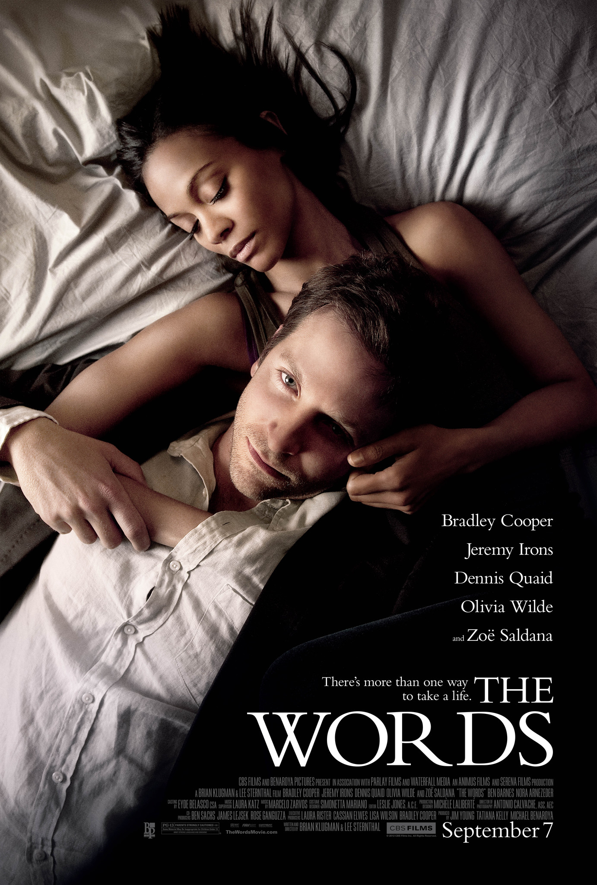

# Filmovi

## Murican
### Can't Hardly Wait (1998)

**IMDB**: 6.5 [link](https://www.imdb.com/title/tt0127723/)

**Opis**: A complete graduating class, consisting of beautiful girls, geeks and promising footballers, assemble at a rich classmate's residence for a party. Interesting developments follow at the get-together.

**Glumci**: Jennifer Love Hewitt, Ethan Embry, Charlie Korsmo

### The Endless Summer 2 (1994)

**IMDB**: 7.6 [link](https://www.imdb.com/title/tt0109729/)

**Opis**: Two famous surfers, Patrick O' Connell and Robert "Wingnut" Weaver, set out for an international worldwide surfing safari adventure with documentary filmmaker Bruce Brown.

**Glumci**: Patrick O'Connell, Robert 'Wingnut' Weaver, Robert August

### Cocktail (1988)

**IMDB**: 5.9 [link](https://www.imdb.com/title/tt0094889/)

**Opis**: A talented New York City bartender takes a job at a bar in Jamaica and falls in love.

**Glumci**: Tom Cruise, Bryan Brown, Elisabeth Shue

### Scarface (1932)

**IMDB**: 7.7 [link](https://www.imdb.com/title/tt0023427/)

**Opis**: An ambitious and nearly insane violent gangster climbs the ladder of success in the mob, but his weaknesses prove to be his downfall.

**Glumci**: Paul Muni, Ann Dvorak, Karen Morley
**Note**: Pre-Code Hollywood

### Boat Trip (2002)

**IMDB**: 4.9 [link](https://www.imdb.com/title/tt0285462/)

**Opis**: Two straight men mistakenly end up on a "gays only" cruise.

**Glumci**: Cuba Gooding Jr., Horatio Sanz, Roselyn Sanchez

### Who's Afraid of Virginia Woolf? (1966)

**IMDB**: 8.0 [link](https://www.imdb.com/title/tt0061184/)

**Opis**: A middle-aged New England associate professor and his wife, with the help of alcohol, use their young guests to fuel anguish and emotional pain towards each other over the course of a distressing night.

**Glumci**: Elizabeth Taylor, Richard Burton, George Segal

### Drinking Buddies (2013)

**IMDB**: 6.1 [link](https://www.imdb.com/title/tt2265398/)

**Opis**: Luke and Kate are coworkers at a brewery who spend their nights drinking and flirting heavily. One weekend away together with their significant others proves who really belongs together and who doesn't.

**Glumci**: Olivia Wilde, Jake Johnson, Anna Kendrick, Ron Livingston

### The Words (2012) (Plagijator)

**IMDB**: 7.0 [link](https://www.imdb.com/title/tt1840417/)

**Opis**: A writer at the peak of his literary success discovers the steep price he must pay for stealing another man's work.

**Glumci**: Bradley Cooper, Dennis Quaid, Olivia Wilde

### Vanilla Sky (2001)

**IMDB**: 6.9 [link](https://www.imdb.com/title/tt0259711/)

**Opis**: A self-indulgent and vain publishing magnate finds his privileged life upended after a vehicular accident with a resentful lover.

**Glumci**: Tom Cruise, Penélope Cruz, Cameron Diaz

### The Sunset Limited (2011)

**IMDB**: 7.3 [link](https://www.imdb.com/title/tt1510938/)

**Opis**: Through a chance encounter, two men of opposing ideologies deliberate spiritual, philosophical, and profound matters in a New York City apartment.

**Glumci**: Samuel L. Jackson, Tommy Lee Jones

### Diner (1982)

**IMDB**: 7.0 [link](https://www.imdb.com/title/tt0083833/)

**Opis**: A group of college-age buddies struggle with their imminent passage into adulthood in 1959 Baltimore.

**Glumci**: Steve Guttenberg, Mickey Rourke, Kevin Bacon

### Dark City (1998)

**IMDB**: 7.0 [link](https://www.imdb.com/title/tt0083833/)

**Opis**: A group of college-age buddies struggle with their imminent passage into adulthood in 1959 Baltimore.

**Glumci**: Steve Guttenberg, Mickey Rourke, Kevin Bacon

## Domaći
### Sta radis veceras (1988)

**IMDB**: 6.7 [link](https://www.imdb.com/title/tt0181025/)

**Opis**: Urban omnibus of three stories about problems of youth. Story I - Three young men from New Belgrade block spend their time together. After finishing their secondary school, they wait for a draft call, trying to get some money in a...

**Glumci**: Nikola Kojo, Nenad Nenadovic, Vladan Dujovic

### Tomorrow Morning (2006)

**IMDB**: 6.8 [link](https://www.imdb.com/title/tt0497273/)

**Opis**: After twelve years spent abroad, the main character returns to his native city, where he meets his old love, friends and parents again They spend four days together and after that nothing will be the same in their lives. TOMORROW ...

**Glumci**: Uliks Fehmiu, Nada Sargin, Nebojsa Glogovac

### Normal People (2001)

**IMDB**: 6.4 [link](https://www.imdb.com/title/tt0277928/)

**Opis**: Suburbs of Belgrade - ghetto in the ghetto. Hopelessness, claustrophobia, post-war atmosphere, depression and loneliness of a generation in the last months of 2000th year and looks like it will never end. The lives of friends, all...

**Glumci**: Nebojsa Glogovac, Ljubinka Klaric, Ivan Jevtovic

### Pejzaži u magli (1984)

**IMDB**: 7.1 [link](https://www.imdb.com/title/tt0087898/)

**Opis**: Naturalistic and almost documentary account of the heroin addicts in Belgrade, in the form of a sad life story of young girl and her wasted life.

**Glumci**: Anamarija Petričević, Ljubomir Todorović, Tihomir Arsić, Milena Zupančić, Rade Šerbedžija, Bata Živojinović.

### Nataša (2001)

**IMDB**: 6.5 [link](https://www.imdb.com/title/tt0283504/)

**Opis**: Seventeen year old Natasha, a daughter of a murdered police inspector, tries to discover her father's killers.

**Glumci**: Tijana Kondić, Nikola Đuričko, Anica Dobra

### Tri palme za dve bitange i ribicu (1998)

**IMDB**: 6.5 [link](https://www.imdb.com/title/tt0283504/)

## Evropski

### Pierrot le fou (1965)

**IMDB**: 7.6 [link](https://www.imdb.com/title/tt0118929/)

**Opis**: A man struggles with memories of his past, which include a wife he cannot remember and a nightmarish world no one else ever seems to wake up from.

**Glumci**: Rufus Sewell, Kiefer Sutherland, Jennifer Connelly

## Anime
### Ghost in the Shell (1995)

**IMDB**: 7.9 [link](https://www.imdb.com/title/tt0113568/)

**Opis**: A cyborg policewoman and her partner hunt a mysterious and powerful hacker called the Puppet Master.

**Glumci**: Atsuko Tanaka, Iemasa Kayumi, Akio Ôtsuka

### Ghost in the Shell (2017)

**IMDB**: 6.3 [link](https://www.imdb.com/title/tt1219827/)

**Opis**: In the near future, Major Mira Killian is the first of her kind: A human saved from a terrible crash, who is cyber-enhanced to be a perfect soldier devoted to stopping the world's most dangerous criminals.

**Glumci**: Scarlett Johansson, Pilou Asbæk, Takeshi Kitano

### Akira (1988)

**IMDB**: 8.0 [link](https://www.imdb.com/title/tt0094625/)

**Opis**: A secret military project endangers Neo-Tokyo when it turns a teenage biker gang member into a rampaging psychic psychopath who can only be stopped by his best friend.

## Kul animacije

### The Man Who Planted Trees (Short 1987)

**IMDB**: 8.5 [link](https://www.imdb.com/title/tt0093488/)

**Opis**: The story of a shepherd's single handed quest to re-forest a barren valley.

## Ostalo
### Amores Perros (2000)

**IMDB**: 8.0 [link](https://www.imdb.com/title/tt0245712/)

**Opis**: An amateur dog fighter, a supermodel, and a derelict assassin, all separately struggling to find love, find their lives transformed by a devastating car wreck in Mexico City.

**Glumci**: Emilio Echevarría, Gael García Bernal, Goya Toledo

### Survive Style 5+ (2004)

**IMDB**: 7.4 [link](https://www.imdb.com/title/tt0430651/)

**Opis**: Five bizarre stories with no apparent connection to one and other eventually become intertwined, resulting in surreal circumstances.

**Note**: Horor komedija kao
